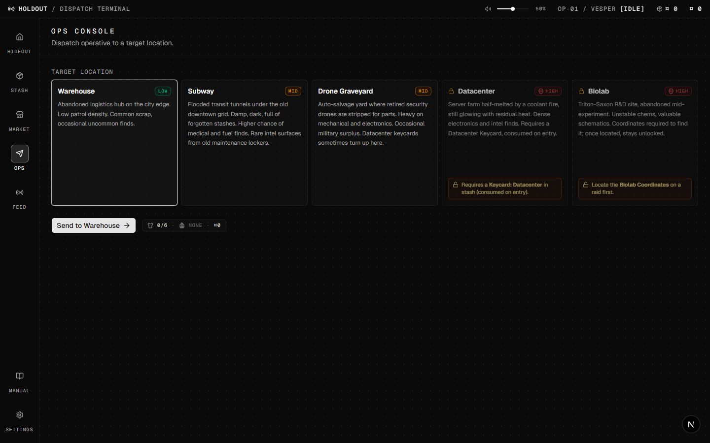
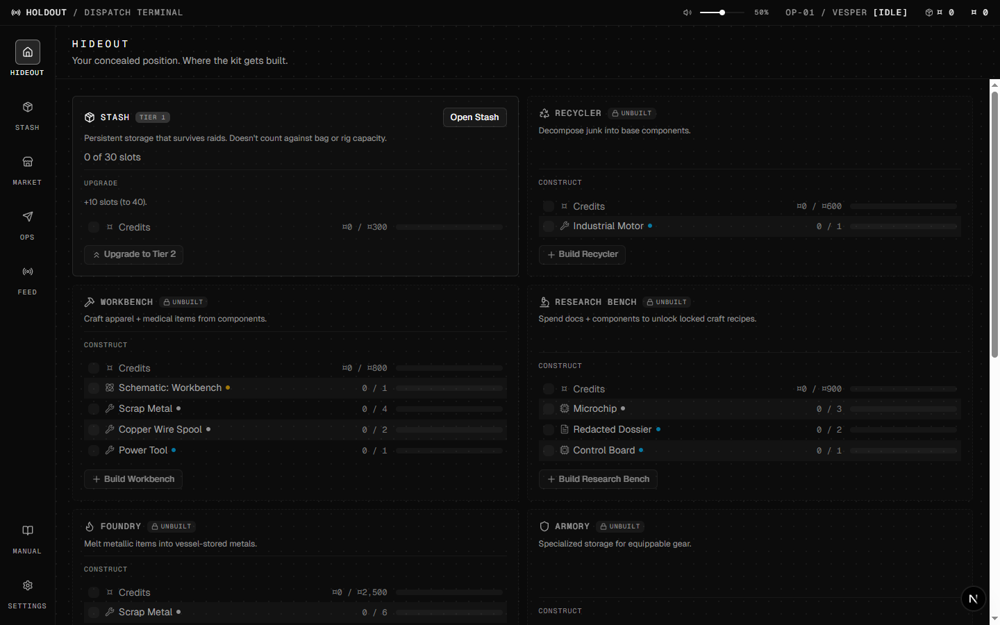
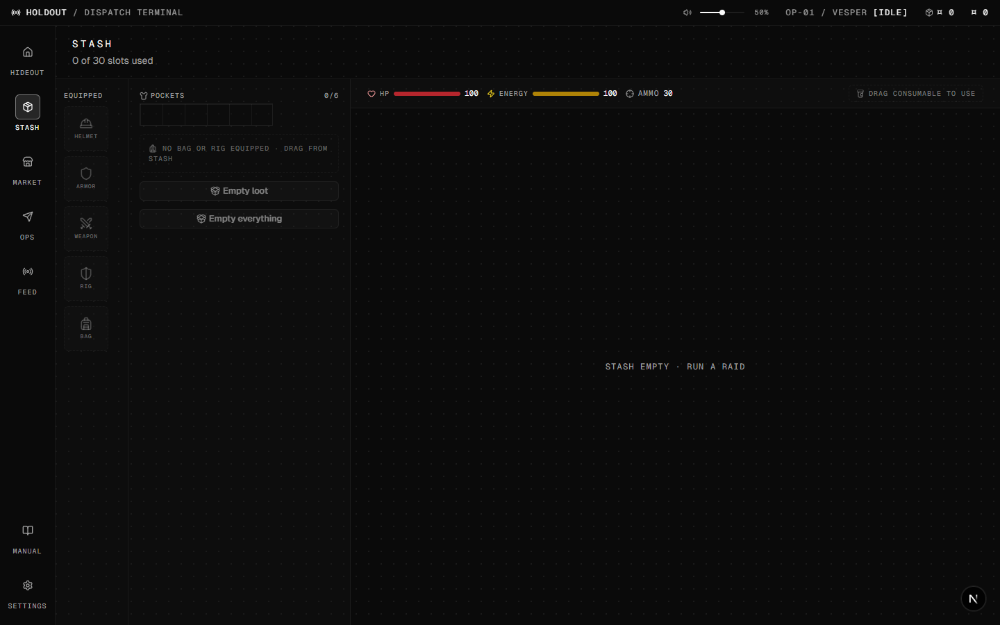
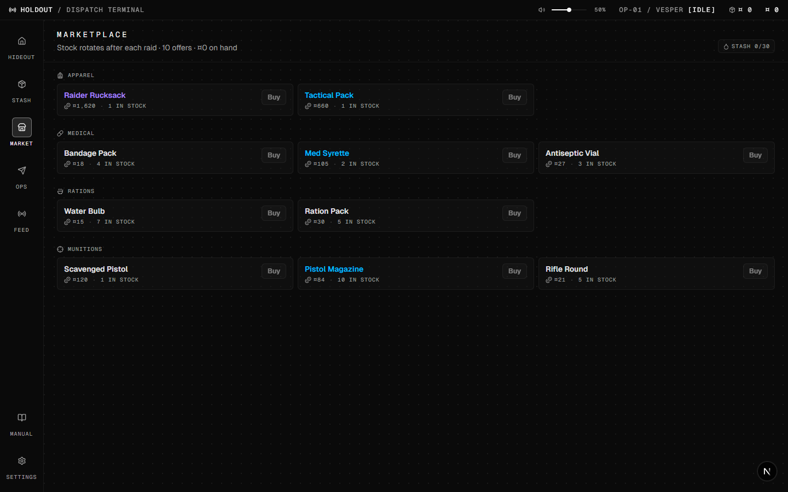
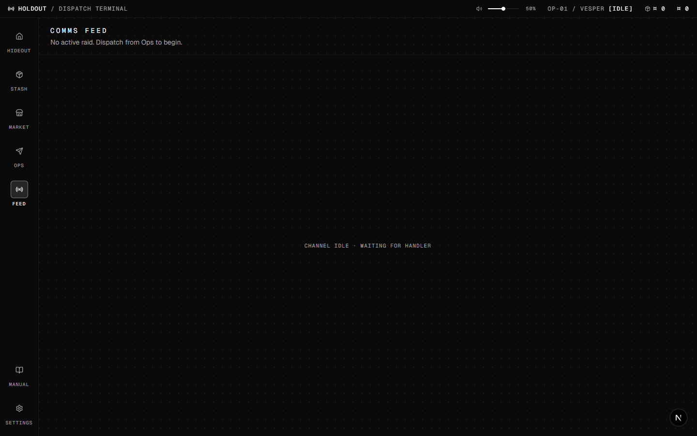

# HOLDOUT

A web-based deep-crafting raid game. You play a handler dispatching one operative on auto-resolved raids in a near-future corporate-military setting (~2090). Watch a texture-rich live comms feed, respond to interrupt events, manage extract risk via Recall, and grow your hideout from a junk pile into a high-tech base over hundreds of hours of endless progression.

The whole game is presented as a fictional **dispatch terminal** — every system is an "app" or panel. shadcn/vercel aesthetic, lucide icons, monochrome accents. No 3D world, no top-down combat. The art direction is the UI itself.

> ⚠️ **Status: in active development.** Playable but unfinished — shared as a work-in-progress.



## Screenshots

| Hideout — grow your base from a junk pile | Stash — inventory & loot |
| :---: | :---: |
|  |  |
| **Market — buy & sell** | **Feed — live comms during a raid** |
|  |  |

## Stack

Next.js 16 · TypeScript · Tailwind 4 · shadcn/ui · Zustand 5 · localStorage save · pnpm

## Run

```bash
pnpm install
pnpm dev          # http://localhost:3000
pnpm test         # Vitest one-shot
pnpm test:watch
```

## Repo layout

```
src/
  app/             Next.js routes (single-page)
  components/      panels (Stash, Ops, Feed, Hideout, Shop, Settings, Manual) + UI primitives
  lib/
    data/          static data (items, events, vocab, locations)
    engine/        pure game logic — actions, raid, map, equipment, save, shop, shapes
  store/           Zustand store (single source of truth)
docs/
  DESIGN.md        canonical design + locked constraints + UI pins
  BACKLOG.md       open work + changelog
  BRAINSTORM.md    blue-sky idea pool
  archive/         historical snapshots (RISKS.md)
AGENTS.md          notes for AI coding agents (root-level convention)
CLAUDE.md          project instructions for Claude Code
experiments/
  firearm-gen/     procedural firearm generator prototype
```

## Where to start reading

1. `docs/DESIGN.md` — what the game is and what's locked
2. `docs/BACKLOG.md` — what's open and what just shipped (changelog at the bottom)
3. `src/lib/engine/raid.ts` — the action loop
4. `src/store/game.ts` — Zustand store

## Credits

UI sound effects are sourced from [Freesound](https://freesound.org/). See [`CREDITS.md`](CREDITS.md) for per-sound attribution and licenses.
